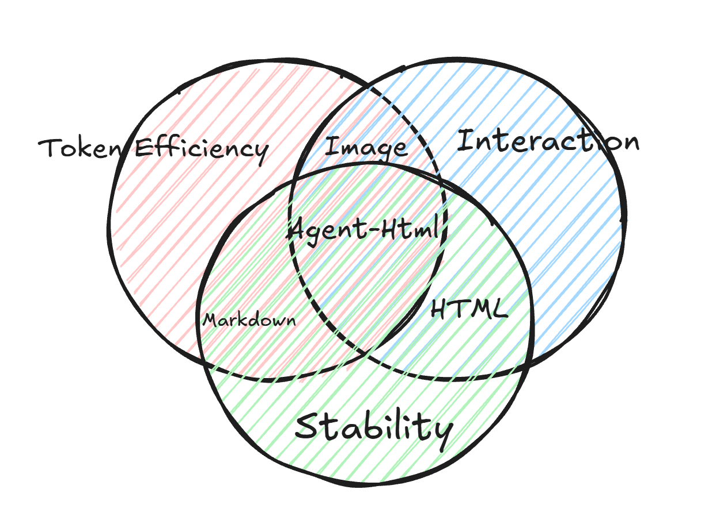

<p align="center">
  
</p>

# agent-html

agent-html turns semantic `.agent.html` documents into stable, shareable HTML artifacts for dense agent work.

<p align="center">
  <a href="https://www.npmjs.com/package/@agent-html/ahtml">
    
  </a>
  <a href="./LICENSE">
    
  </a>
  <a href="https://agent-html.pages.dev/docs">
    
  </a>
</p>

<p align="center">
  
</p>

Docs: [agent-html.pages.dev/docs](https://agent-html.pages.dev/docs)

## Quick Start

### 1. Install the CLI

```bash
npm install -g @agent-html/ahtml
ahtml
```

### 2. Optional: install the ahtml skill

If you use the `skills` CLI with Codex or other agents, install the `ahtml` skill:

```bash
npx skills add Sayhi-bzb/Agent-HTML --skill ahtml
```

### 3. Get the writing prompt and write a document

```bash
ahtml prompt
```

```html
<meta-agent profile="report-default" />

<page title="Review">
  <card title="Summary">
    This review is a stable HTML artifact instead of a long Markdown note.
  </card>
</page>
```

### 4. Render HTML

```bash
ahtml build artifact.agent.html
ahtml preview artifact.agent.html
```

Open the preview URL printed by `ahtml preview` to review the output.

## How It Works

```txt
agent work
  -> semantic .agent.html
  -> schema validation
  -> portable HTML artifact
```

The schema is the public contract. Agents write content structure, not raw HTML, CSS, JavaScript, Tailwind classes, or renderer props.

## More

```roadmap
╭────── Roadmap
│
●       ·Architecture optimization
├──╮
●  │    ·Support more UI foundations
│  │
│  ●    ·app
│  │
●  │    ·Separation of static and interactive component data structures
│  │
│  ●    ·request-response -> interact-interact
│  │
│  ●    ·Custom component panel
╭──╯
●       ·Cloud service
│
╰──────────────
```

- [Quick Start](https://agent-html.pages.dev/docs)
- [Best Practice](https://agent-html.pages.dev/docs/best-practice)
- [Dev Docs](https://agent-html.pages.dev/docs/dev-docs)
- [Examples](https://agent-html.pages.dev/docs/example)
